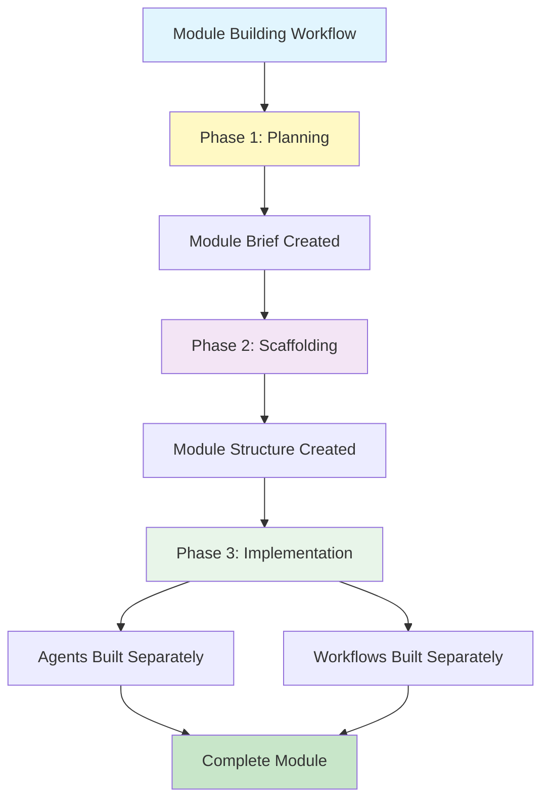

Building a BMad module happens in distinct phases. Understanding this separation prevents confusion and ensures you know what happens when.

:::tip[Key Concept]
**Module building creates scaffolding, not finished content.** The agents and workflows are planned and stubbed out, but you build them separately using specialized workflows.
:::

## The Three Phases of Module Creation



### Phase 1: Planning (The Brief)

**What happens:** You work with Morgan (the module-builder agent) to create a **module brief** — a vision document that defines your module's purpose, audience, agents, and workflows.

**What gets created:**
- `module-brief-{code}.md` — A detailed vision document
- Clear definitions of what agents you need
- Clear definitions of what workflows you need
- Scenarios describing how users will interact with your module

**What does NOT get created:**
- No actual agent `.agent.yaml` files yet
- No actual workflow `.md` files yet
- No implementation details

:::note[Why Separate Planning?]
The brief is exploratory and creative. You're discovering what your module should BE — not worrying about HOW to implement it. This separation lets you think deeply about user needs before technical details.
:::

### Phase 2: Scaffolding (The Structure)

**What happens:** Morgan reads your module brief and creates the **module structure** — all the files, folders, and configuration needed for a working module.

**What gets created:**
```
your-module/
├── src/
│   ├── module.yaml              # Module metadata and config
│   ├── module-help.csv          # Feature registry (auto-generated)
│   ├── agents/                  # Agent directory
│   │   └── your-agent.agent.yaml  # Agent SPEC files (stubs)
│   ├── workflows/               # Workflow directory
│   │   └── your-workflow/        # Workflow SPEC files (stubs)
│   │       └── workflow.md
│   └── _module-installer/       # Custom install prompts (if needed)
├── package.json                  # NPM package config
├── README.md                     # Documentation template
└── TODO.md                       # Implementation checklist
```

**What these SPEC files contain:**
- **Agent specs** — Persona definitions (name, role, voice) as references for workflows
- **Workflow specs** — Outline of steps, goals, structure (not finished workflows)

**What does NOT get created:**
- No fully implemented agent prompts
- No detailed workflow step files
- No sidecar memory structures
- No actual functionality

:::note[Agents in Modules]
In a module, agents serve as **persona references**. The workflows themselves contain the actual persona — each workflow speaks in the voice of the relevant agent. The module's agents define who these personas are, but the workflows bring them to life.
:::

:::note[Why Separate Scaffolding?]
Morgan creates the ARCHITECTURE — the skeleton that everything connects to. The actual PROMPTS and STEP CONTENT are built by specialists who excel at those specific tasks.
:::

### Phase 3: Implementation (The Building)

**What happens:** You use specialized workflows to build each component:

| Component | Builder | Workflow |
|-----------|---------|----------|
| **Agents** | Bond | `bmad:bmb:agents:agent-builder` |
| **Workflows** | Wendy | `bmad:bmb:workflows:workflow-builder` |

**What gets created here:**
- Full agent `.agent.yaml` files with complete personas, prompts, menus
- Full workflow `.md` files with detailed step files
- Sidecar memory structures
- Actual functionality

:::tip[Why This Separation Matters]
Bond specializes in agent architecture. Wendy specializes in workflow design. Morgan specializes in system design. Each workflow is optimized for its specific task. Trying to do everything in one workflow would compromise quality.
:::

## Complete Example: Building a Wedding Planner Module

Let's trace a complete module build from idea to implementation.

### Phase 1: Planning — The Brief

You run `[PB]` (product brief) with Morgan:

```
[PB]
```

Morgan asks:
- **What problem are you solving?** "Planning a wedding is overwhelming — couples forget tasks, blow budgets, and stress over details"
- **Who is this for?** "Engaged couples with busy lives"
- **What agents would help?** "A budget tracker, a vendor coordinator, a timeline manager"
- **What workflows would help?** "Budget planning, vendor checklist, day-of timeline"

**Result:** `module-brief-wedding.md` — a 20-page vision document with:
- Three agent definitions (Budget Specialist, Vendor Coordinator, Timeline Manager)
- Three workflow definitions (Budget Workshop, Vendor Vetting, Day-Of Schedule)
- User scenarios and journey mapping
- Creative direction (calm, organized, reassuring tone)

### Phase 2: Scaffolding — The Structure

You run `[CM]` (create module) with Morgan:

```
[CM]
```

Morgan reads your brief and creates:

```
wedding-planner/
├── src/
│   ├── module.yaml
│   ├── module-help.csv
│   ├── agents/
│   │   ├── budget-specialist.agent.yaml       # SPEC
│   │   ├── vendor-coordinator.agent.yaml      # SPEC
│   │   └── timeline-manager.agent.yaml        # SPEC
│   ├── workflows/
│   │   ├── budget-workshop/
│   │   │   └── workflow.md                    # SPEC
│   │   ├── vendor-vetting/
│   │   │   └── workflow.md                    # SPEC
│   │   └── day-of-schedule/
│   │       └── workflow.md                    # SPEC
├── package.json
├── README.md
└── TODO.md
```

**What the SPEC files contain:**

`budget-specialist.agent.yaml` (spec):
```yaml
# SPEC FILE - NOT READY FOR USE
agent:
  metadata:
    name: "Penny"
    title: "Budget Specialist"
    # TODO: Define persona, prompts, menu
```

`budget-workshop/workflow.md` (spec):
```markdown
# Budget Workshop

**Goal:** TODO — Create comprehensive wedding budget

**Your Role:** TODO — Budget guide

## WORKFLOW ARCHITECTURE
TODO - Not implemented yet
```

### Phase 3: Implementation — Building Components

Now you build each component using specialists.

#### Building an Agent (Bond)

For the Budget Specialist:

```
bmad:bmb:agents:agent-builder
```

Bond walks you through:
- Persona development (Penny's personality, expertise, communication style)
- Prompt architecture (financial analysis, budget categories, vendor negotiation tips)
- Menu design (quick actions, deep dives, reporting)
- Memory structure (what Penny remembers about your budget)

Bond replaces the spec with a complete `.agent.yaml` file.

#### Building a Workflow (Wendy)

For the Budget Workshop:

```
bmad:bmb:workflows:workflow-builder
```

Wendy walks you through:
- Step architecture (assessment → categorization → allocation → contingency)
- Progressive disclosure (don't overwhelm with everything at once)
- Decision points (when to revisit, when to adjust)
- Output design (budget spreadsheet format)

Wendy creates a complete workflow with step files:
```
budget-workshop/
├── workflow.md
├── steps/
│   ├── step-01-assess.md
│   ├── step-02-categorize.md
│   ├── step-03-allocate.md
│   └── step-04-contingency.md
```

### Final Result

After Phase 3, your module is complete and functional:

```
wedding-planner/
├── src/
│   ├── module.yaml                          # ✅ Complete
│   ├── module-help.csv                      # ✅ Complete
│   ├── agents/
│   │   ├── budget-specialist.agent.yaml     # ✅ Built by Bond
│   │   ├── vendor-coordinator.agent.yaml    # ✅ Built by Bond
│   │   └── timeline-manager.agent.yaml      # ✅ Built by Bond
│   ├── workflows/
│   │   ├── budget-workshop/                 # ✅ Built by Wendy
│   │   ├── vendor-vetting/                  # ✅ Built by Wendy
│   │   └── day-of-schedule/                 # ✅ Built by Wendy
├── package.json                             # ✅ Complete
├── README.md                                # ✅ Complete
└── TODO.md                                  # ✅ All items checked
```

## Why This Architecture Works

| Benefit | Explanation |
|---------|-------------|
| **Specialization** | Each builder optimizes for their domain — agents, workflows, or modules |
| **Incremental** | Build one component at a time, test as you go |
| **Reusability** | Agents and workflows can be reused across modules |
| **Clarity** | Planning before building prevents scope creep |
| **Quality** | Each component gets expert attention |

## Common Confusions

| Confusion | Reality |
|-----------|----------|
| "The module builder creates agents" | Morgan creates **agent specs** — Bond builds actual agents |
| "I should write agent prompts in the brief" | No — brief defines WHAT, not HOW. Prompts come later |
| "The module is done after scaffolding" | No — scaffolding creates structure, not content |
| "I need to do everything at once" | No — build incrementally, one component at a time |

## Your Module Building Checklist

- [ ] **Phase 1: Planning**
  - [ ] Run `[PB]` to create module brief
  - [ ] Define all agents needed
  - [ ] Define all workflows needed
  - [ ] Map user journey and scenarios

- [ ] **Phase 2: Scaffolding**
  - [ ] Run `[CM]` to create module structure
  - [ ] Review generated `module.yaml`
  - [ ] Review generated `module-help.csv`
  - [ ] Check spec files match your vision

- [ ] **Phase 3: Implementation**
  - [ ] For each agent: Run `agent-builder` with Bond
  - [ ] For each workflow: Run `workflow-builder` with Wendy
  - [ ] Test each component independently
  - [ ] Run `[VM]` to validate complete module

## See Also

- **[Create Your First Module](docs/tutorials/create-your-first-module.md)** — Hands-on tutorial
- **[Discover Your Module Idea](docs/how-to/discover-your-module-idea.md)** — Finding the right idea
- **[What Are Modules](docs/explanation/what-are-modules.md)** — Module concepts
- **[Agent or Module Decision Guide](docs/how-to/agent-or-module-decision.md)** — What to build
