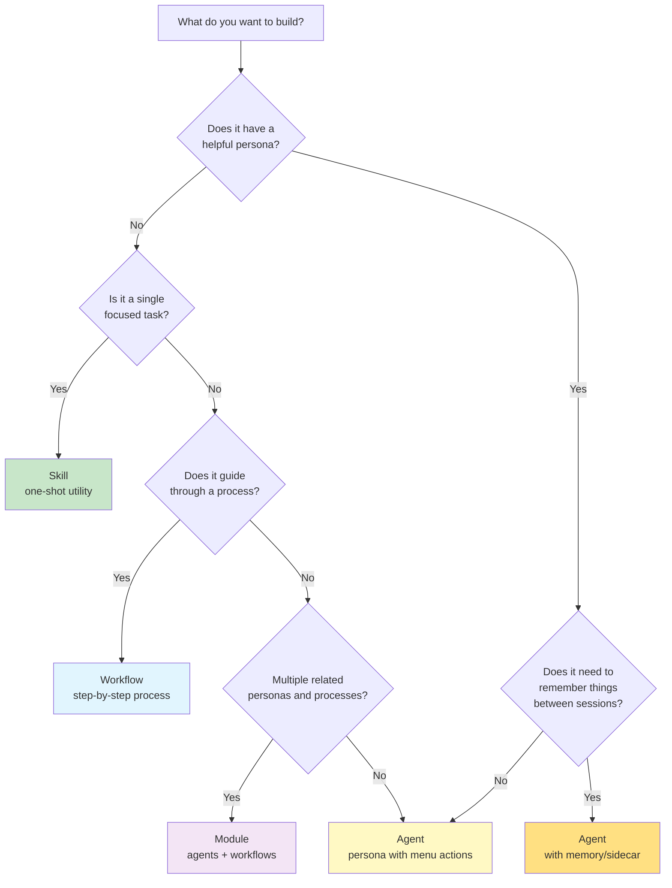

Use this guide to decide what type of BMad component to build based on your needs.

:::note[Prerequisites]
- Familiarity with what skills, agents, workflows, and modules are
- A problem you want to solve or an idea you want to explore
- 5-10 minutes to work through the decision tree
:::

## When to Use This Guide

Use this when you're:
- Starting a new BMad project and unsure what to build
- Deciding if your idea needs an agent or could be a simpler skill
- Planning whether to invest in a full module with multiple agents and workflows

## Quick Decision Tree



## Understanding the Hierarchy

BMad components build on each other:

```
Skill (action) → Agent (persona with skills) → Module (agents + workflows)
```

| Component | What It Is | Key Feature |
|-----------|------------|-------------|
| **Skill** | A single action | No persona — just does something |
| **Agent** | A helpful persona | Menu-driven skills, optional memory |
| **Workflow** | A guided process | Steps with facilitation, may have persona |
| **Module** | Integrated system | Multiple agents + workflows, shared purpose |

:::tip[Agent = Helpful Persona]
Think of agents as helpful personas with skills in their menu. An agent may or may not have memory (sidecar) depending on whether it needs to remember things between sessions.
:::

## The Key Difference: Does It Need a Persona?

The first question to ask: **Does your idea need a helpful persona?**

| Has a Persona? | Build This... | Why |
|----------------|---------------|-----|
| **Yes** | Agent (with or without memory) | Agents ARE personas — helpful characters with skills in their menu |
| **No** | Skill or Workflow | Skills and workflows DO things. They don't need to be someone |

:::tip[Persona Check]
If you can describe your creation as "he" or "she" — if it has a name, a voice, a way of interacting — it's an agent. If it's just "it" — a thing that performs a function — it's probably a skill.
:::

## Type Comparison

### Skill

**Best for:** Single-purpose utilities that don't need a persona.

| Characteristics | |
|-----------------|-|
| **Persona** | None — it's a tool, not a character |
| **Memory** | None — each use is independent |
| **Complexity** | Low — one thing, done well |
| **Building time** | 5-10 minutes |
| **Example ideas** | Currency converter, tip calculator, unit converter, timestamp formatter, QR code generator |

**When to choose:**
- Task is straightforward and single-purpose
- No conversation needed — input → output
- No persona required — it's a utility
- You want the fastest path to a working tool

**When NOT to choose:**
- You want a friendly, funny, or themed experience
- The task benefits from conversation or clarification
- You want to build a relationship with users

**Build with:** Add to any existing agent or workflow as a skill/action

### Agent

**Best for:** A helpful persona with related skills available through a menu.

| Characteristics | |
|-----------------|-|
| **Persona** | Yes — has a name, voice, character |
| **Skills** | Baked into menu — user selects from available actions |
| **Memory** | Optional — add sidecar if it needs to remember things |
| **Complexity** | Low-Medium — focused persona with related skills |
| **Building time** | 15-60 minutes |

**Memory?** Add a sidecar if your agent needs to remember:
- User preferences or settings
- Project state or history
- Past decisions or progress
- Long-term tracking

**No memory needed** when:
- Each conversation is independent
- Skills are simple (1-2 prompt lines each)
- Nothing to carry forward between sessions

**Example ideas:**

| Without Memory | With Memory |
|----------------|------------|
| Commit Poet (poetic commit messages) | Novel writing companion |
| Snarky Weather Bot | Fitness coach with PR tracking |
| Pun-making Barista | Therapist agent |
| Motivational Gym Bro | Language tutor |
| Sassy Fortune Teller | Financial planner |

**When to choose:**
- You want a specific persona or voice
- All skills are related to that persona's purpose
- Interaction happens through menu selection
- Skills are simple enough to be 1-2 prompt lines each

**Build with:** `bmad:bmb:agents:agent-builder` — add sidecar if memory is needed

### Workflow

**Best for:** Guided processes where users move through defined steps.

| Characteristics | |
|-----------------|-|
| **Persona** | Optional — can have a guide or be neutral facilitator |
| **Memory** | Optional — can be stateless or track progress |
| **Complexity** | Medium — multiple steps with decision points |
| **Building time** | 30-45 minutes |
| **Example ideas** | Brainstorming session, trip planning process, workout builder, tax preparation flow, meditation session, journaling practice |

**When to choose:**
- Process has clear stages or steps
- Users benefit from guidance and progressive disclosure
- Process benefits from structure
- May or may not have a guide persona

**Build with:** `bmad:bmb:workflows:workflow-builder`

### Module

**Best for:** Complete solutions with multiple agents and workflows working together.

| Characteristics | |
|-----------------|-|
| **Components** | Multiple agents + multiple workflows |
| **Key distinction** | Workflows are primary — agents are personas that workflows reference |
| **Sequence** | Often has implied journey or phases |
| **Complexity** | High — coordinated system |
| **Building time** | 2-4 hours (including component building) |
| **Example ideas** | Wedding planner, legal office suite, mental wellness program, fitness coaching system, D&D campaign toolkit, kitchen companion |

:::note[Agents in Modules]
In a module, agents serve as persona references. The workflows themselves contain the actual persona — each workflow speaks in the voice of the relevant agent. The module's agents define who these personas are, but the workflows bring them to life. Agents in modules may or may not have sidecars depending on whether they need memory.
:::

**When to choose:**
- Multiple related capabilities work better together
- Different personas for different aspects
- Guided journeys through processes
- Want to share or publish a complete solution
- Users benefit from integrated experience

**Build with:** Morgan (`[PB]` → `[CM]`)

## Decision Questions

### Question 1: Does It Have a Persona?

**Persona means:** A helpful character with a name, voice, and way of interacting.

| If Your Idea Has... | Build This... |
|--------------------|---------------|
| A character, voice, or style | **Agent** |
| Just does a task, no character | **Skill** or **Workflow** |

**Examples:**

| Idea | Persona? | Type |
|------|--------------|------|
| "Convert currencies" | No — just a calculation | **Skill** |
| "A snarky weather bot that complains about your location" | Yes — sarcastic character | **Agent** |
| "A motivational gym bro who hypes you up" | Yes — enthusiastic bro persona | **Agent** |
| "Generate QR codes" | No — just a utility | **Skill** |
| "A sassy fortune teller" | Yes — mystical, dramatic character | **Agent** |
| "Calculate tips" | No — just math | **Skill** |

### Question 2: Does It Need Memory?

**Memory means:** Remembering information between conversations — user preferences, project state, past decisions, progress tracking.

| If You Need Memory... | Build This... |
|---------------------|---------------|
| User preferences, settings, ongoing projects | **Agent with sidecar** |
| Long-term tracking, progress over time | **Agent with sidecar** |
| Each conversation is independent | **Agent** (no sidecar) or **Skill** |

**Examples:**

| Idea | Memory Needed? | Type |
|------|----------------|------|
| "Motivational gym bro" | No — hypes you up fresh each time | Agent (no sidecar) |
| "Fitness coach who remembers your PRs and tracks progress" | Yes — needs your workout history | Agent with sidecar |
| "Snarky weather bot" | No — each weather check is independent | Agent (no sidecar) |
| "Writing companion who remembers your novel's characters" | Yes — needs story context | Agent with sidecar |
| "Sassy fortune teller" | No — each reading is standalone | Agent (no sidecar) |
| "Language tutor who tracks your vocabulary" | Yes — needs your learning history | Agent with sidecar |

### Question 3: Single Task or Guided Process?

| If Your Idea Is... | Build This... |
|--------------------|---------------|
| One-shot utility (no persona) | **Skill** |
| One-shot utility (WITH persona) | **Agent** |
| Guided multi-step process | **Workflow** |
| Multiple personas + processes | **Module** |

**Examples:**

| Idea | Type | Why |
|------|------|-----|
| "Currency converter" | Skill | Utility, no persona, no steps |
| "Pun-making barista" | Agent | One persona, related skills in menu |
| "Plan a trip" | Workflow | Guided multi-step process |
| "Complete kitchen suite: recipes + meals + groceries" | Module | Multiple personas (chef, planner) + processes |

### Question 4: Should It Be a Module?

The key distinction: **Does it need multiple agents and workflows working together?**

| Module Indicators | Build Module When... |
|------------------|---------------------|
| Multiple personas | Different aspects need different voices |
| Workflow-driven | Processes have steps with facilitation |
| Related capabilities | Things work better together |
| Implied journey | Phases or sequence make sense |

**Remember:** In a module, workflows are primary. Agents define the personas, but workflows contain the actual persona in their steps.

## Real-World Decision Examples

### Example 1: "I want a currency converter"

**Questions:**
- Persona? No — just converts numbers
- Memory needed? No — each conversion is independent
- Single task? Yes

**Decision:** **Skill**
- Add as an action to any agent
- Input: amount and currencies
- Output: converted amount
- No conversation needed

### Example 2: "I want a commit message poet"

**Questions:**
- Persona? Yes — poetic drama, "Inkwell Von Comitzen"
- Memory needed? No — each commit is independent
- Skills related? Yes — all about commit messages in different styles (haiku, conventional, story, etc.)
- Each skill is 1-2 prompt lines

**Decision:** **Agent** (no sidecar) — "Commit Poet"
- Persona: Poetic drama and flair
- Skills (menu items): Write commit, analyze changes, improve message, batch commits, conventional format, story format, haiku format
- All skills fit the persona
- No workflow needed — menu-driven
- No memory needed

### Example 3: "I want a snarky weather bot"

**Questions:**
- Persona? Yes — sarcastic, complains about your location
- Memory needed? No — each weather check is independent
- Single skill? Essentially yes — fetch weather and add snark

**Decision:** **Agent** (no sidecar)
- Character: "Storm" the grumpy meteorologist
- Voice: Sarcastic, complains about humidity, judges your location choices
- No memory — fresh snark each time

### Example 4: "I want help planning my wedding"

**Questions:**
- Multiple personas? Yes — budget specialist (analytical), vendor coordinator (organized), timeline manager (detail-oriented)
- Workflow-driven? Yes — budget workshop, vendor vetting, day-of schedule
- Related capabilities? Yes — all part of wedding planning
- Implied journey? Yes — budget → vendors → timeline

**Decision:** **Module** — "Wedding Planner"
- **Agents** define personas: Budget Specialist, Vendor Coordinator, Timeline Manager
- **Workflows** carry the personas: Each workflow speaks in the relevant agent's voice
- Workflows guide users through processes step-by-step
- Agents are referenced by workflows, not used directly

### Example 5: "I want a fitness buddy"

**Questions:**
- Persona? Yes — motivational, tough-love, or gentle cheer
- Memory needed? Yes — needs to remember your workouts, PRs, goals
- Single persona or multiple? One persona fits

**Decision:** **Agent with sidecar** — "Fitness Buddy"
- Persona: Motivational gym bro (or gentle encourager)
- Remembers: Your PRs, workout history, preferences, goals
- Tracks progress over time
- Menu-driven skills: Log workout, view progress, suggest exercises, etc.

### Example 6: "I want a wellness program"

**Questions:**
- Multiple personas? Yes — wellness companion (empathetic), meditation guide (serene)
- Workflow-driven? Yes — daily checkin, wellness journal, guided meditation
- Related capabilities? Yes — all part of mental wellness
- Implied journey? Yes — checkin → journal → meditate

**Decision:** **Module** — "Wellness Companion"
- **Agents**: Wellness Companion (Riley), Meditation Guide (Serenity)
- **Workflows**: Daily Checkin (Riley's voice), Wellness Journal (Riley's voice), Guided Meditation (Serenity's voice)
- Workflows contain the actual persona in their steps
- anytime skills: Quick breathing, mood check (agent menu items)

### Example 7: "I want a tip calculator"

**Questions:**
- Persona? No — just math
- Memory needed? No — each bill is independent
- Single task? Yes

**Decision:** **Skill**
- Simple utility
- Add to any agent as an action
- Input: bill amount, tip percentage, party size
- Output: per-person amount

:::note[Make It Fun?]
You COULD make "Tip Calculator" an Agent with personality (like a sassy waiter who judges your tipping). But ask: is the persona adding value? If it's just a one-time calculation, a skill is faster and simpler.
:::

## Starting Small, Growing Big

You don't have to start with a module. Many successful modules grow from simpler beginnings:

| Start As | Evolve Into | Example |
|----------|-------------|---------|
| Skill | Agent | Unit converter → Snarky converter with persona |
| Agent (no memory) | Agent with sidecar | Motivational quotes → Fitness coach with memory |
| Agent | Module | Novel helper → Story Architect Module with multiple agents and workflows |
| Workflow | Module | Brainstorming → Creative Intelligence Suite |

:::tip[Iterate]
Build the smallest thing that solves your core problem. Add complexity only when needed. Your users will tell you what's missing.
:::

## What You Get

After working through this guide, you'll know:

- Whether to build a skill, agent, or module
- Whether your agent needs memory (sidecar)
- Whether your idea justifies a full module with multiple agents and workflows
- The appropriate builder workflow to use

## Next Steps

Once you've decided:

| If You Chose... | Next Step |
|-----------------|-----------|
| **Skill** | Add as an action to an existing agent or workflow |
| **Agent** | [Create a Custom Agent](docs/tutorials/create-custom-agent.md) |
| **Agent with sidecar** | [Create a Custom Agent](docs/tutorials/create-custom-agent.md) (enable sidecar) |
| **Workflow** | [Create Your First Workflow](docs/tutorials/create-your-first-workflow.md) |
| **Module** | [Create Your First Module](docs/tutorials/create-your-first-module.md) |
| **Still Unsure** | [Discover Your Module Idea](docs/how-to/discover-your-module-idea.md) |

## Tips

**Start with the problem, not the solution.** "I need a module" is starting with solution. "I need to plan meals for my family" is starting with problem.

**Build for yourself first.** If you genuinely need and use it, others will too.

**Keep scope tight.** Your first creation should do ONE thing well. Add features later.

**Personas are optional.** Not everything needs a character. Utilities are valuable too.

**Think ecosystem.** Your "Meal Planner Agent" could complement someone else's "Recipe Generator Module." Collaboration beats competition.

:::tip[No Wrong Choice]
Whatever you choose, you're learning. Skills can grow into agents. Agents can evolve into modules. Build something, use it, and let it evolve.
:::
